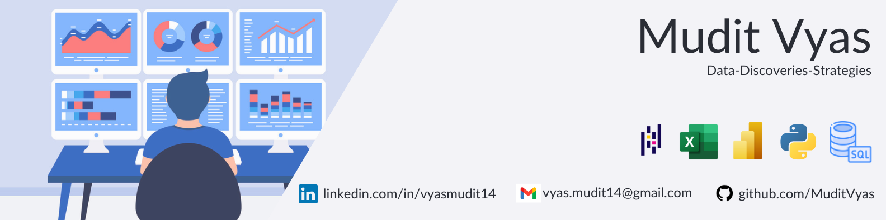

<h1 align="center">Hi 👋🏼, I'm Mudit Vyas</h1>
<h3 align="center">I decode data, unveil discoveries and enhance strategies</h3>

🔭 I am a Data Analyst with proficent in skills such as Excel, SQL, python and data visualisation

📈 I am seeking a new opportunity where I can focus on developing my skills in data analytics and visualization.

👩🏻‍💻 I am committed to improvements and learnings and focus on my professional and personal growth. 
 
✈️ Apart from Data Analysis, I like to sing, play badminton and watch cricket.

<h3 align="left">Languages and Tools:</h3>
Excel/VBA - Python (Pandas - NumPy - SciPy - Matplotlib - Dash- Plotly-Flask) - SQL - MySQL-SQLite- Power BI- Statistics - Jupyter Notebook 

 <h3 align="left">Connect with me:</h3>

&nbsp; &nbsp; &nbsp;

<!--
**MuditVyas/MuditVyas** is a ✨ _special_ ✨ repository because its `README.md` (this file) appears on your GitHub profile.

Here are some ideas to get you started:

- 🔭 I’m currently working on ...
- 🌱 I’m currently learning ...
- 👯 I’m looking to collaborate on ...
- 🤔 I’m looking for help with ...
- 💬 Ask me about ...
- 📫 How to reach me: ...
- 😄 Pronouns: ...
- ⚡ Fun fact: ...
-->
